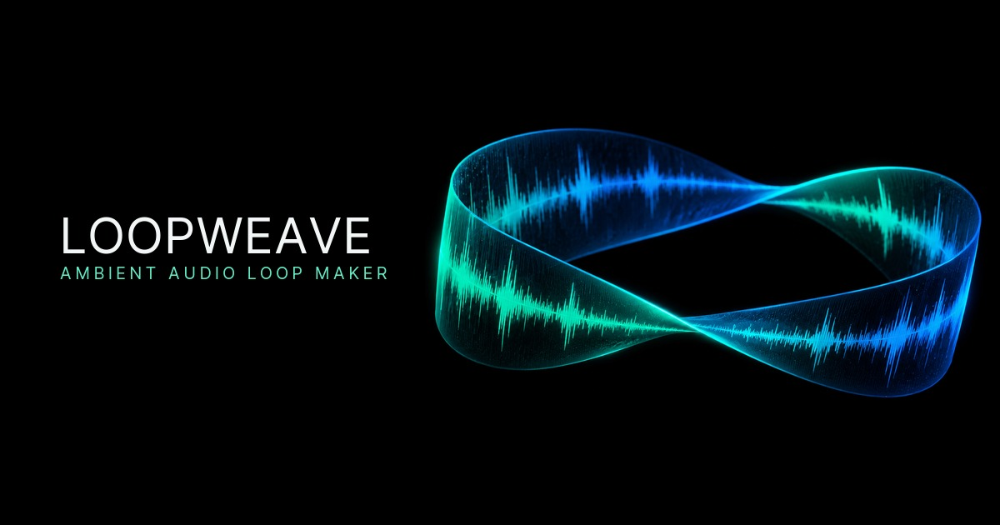

# Loopweave

[](https://loopweave.specr.net)

Loopweave is a browser-first audio texture tool that finds, renders, auditions, and exports perceptually promising loops from an arbitrary recording. Audio decoding and every analysis step happen locally; user audio is never uploaded. These audio files can be used for ambience, ASMR, and other loopable content.

Loopweave is fully deployed and ready to use at [loopweave.specr.net](https://loopweave.specr.net). No installation or local build is required.

## Demo

<video src="https://raw.githubusercontent.com/scpedicini/loopweave/refs/heads/main/docs/assets/loopweave-demo.mp4" controls></video>

## Current vertical slice

- Drag-and-drop browser decoding for locally supported audio formats.
- Worker-owned PCM and DSP so long analysis does not block the interface.
- Multiresolution spectral features and content-regime estimation.
- Bounded recurrence search without a dense self-similarity matrix.
- Joint endpoint refinement and hard-cut/crossfade selection.
- Correlation-aware, equal-power, and linear circular overlap rendering.
- Multiple ranked alternatives, diagnostics, and an explicit confidence verdict.
- Persistent loop-length constraints with a per-file source-maximum shortcut.
- Original-source playback and waveform playheads for source and loop previews.
- Full-loop and focused seam auditioning, plus baked 24-bit WAV export.

This is an engineering foundation, not a trained perceptual oracle. Objective scoring still needs calibration against a serious listening-test corpus before quality numbers should be treated as production claims.

## Commands

```sh
pnpm install
pnpm dev
pnpm test
pnpm check
pnpm quality
```

The development server uses port `6772`. `pnpm build` produces a static `dist/` deployment.

## Browser constraints

`decodeAudioData()` decodes a complete file into memory. Stereo 48 kHz float PCM costs roughly 22 MiB per minute before temporary buffers. The current application is therefore desktop-first. Streaming codecs, OPFS scratch storage, and WebAssembly/SIMD kernels are planned performance layers, not architectural rewrites.

See [ARCHITECTURE.md](./ARCHITECTURE.md) for the component boundaries and backend path.
