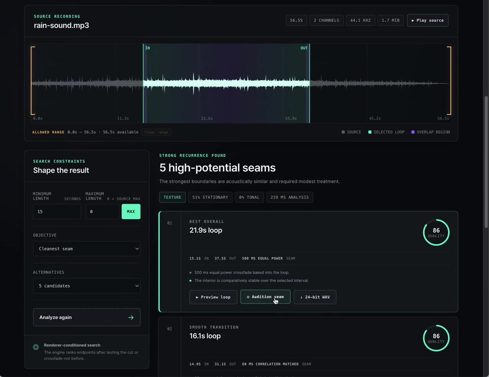

# Loopweave

<p align="center">
  <a href="https://loopweave.specr.net">
    
  </a>
</p>

<p align="center"><strong>Turn longer ambient recordings into seamless, export-ready loops—entirely in your browser.</strong></p>

<p align="center">Local audio processing · Nothing uploaded · 24-bit WAV export</p>

<p align="center">
  <a href="https://loopweave.specr.net"><strong>Open the live app →</strong></a>
  ·
  <a href="./docs/assets/loopweave-demo.mp4">Watch the demo</a>
  ·
  <a href="./ARCHITECTURE.md">Read the architecture</a>
</p>

Loopweave is a browser-first audio texture tool for ambience, ASMR, games, soundscapes, and other loopable content. Give it a longer recording—rain, running water, crackling fire, room tone, or another steady sound—and it finds promising places to repeat, blends the transition, and lets you audition and export the result.

It is fully deployed at **[loopweave.specr.net](https://loopweave.specr.net)**. There is nothing to install unless you want to develop or run it locally.

## See it in action

<p align="center">
  <a href="./docs/assets/loopweave-demo.mp4">
    
  </a>
</p>

<p align="center">
  <a href="./docs/assets/loopweave-demo.mp4">▶ Watch the 31-second demo</a>
  ·
  <a href="https://loopweave.specr.net">Try it with your own recording</a>
</p>

## From recording to seamless loop

1. **Drop in a recording.** Loopweave decodes any locally supported browser audio format, including WAV, MP3, FLAC, Ogg, M4A, and AIFF.
2. **Shape the search.** Select the allowed region, loop-length range, search objective, and number of alternatives.
3. **Compare the seams.** Preview complete loops or audition only the transition while inspecting ranked candidates and diagnostics.
4. **Export the result.** Download a baked 24-bit WAV that loops without requiring runtime crossfade support.

## Highlights

- Audio decoding, analysis, rendering, and auditioning stay in the browser; source audio is never uploaded.
- Worker-owned PCM and DSP keep long analysis work off the interface thread.
- Multiresolution spectral features identify recurring acoustic states without building a dense self-similarity matrix.
- Full-resolution endpoint refinement jointly evaluates hard cuts and content-dependent crossfades.
- Correlation-aware, equal-power, and linear circular overlap renderers are tested before candidates are ranked.
- Multiple alternatives include diagnostics and an explicit confidence verdict rather than presenting one opaque answer.
- Source and loop playback share waveform playheads, editable search boundaries, full-loop previewing, and focused seam auditioning.

## Run locally

```sh
pnpm install
pnpm dev
```

The development server runs at [localhost:6772](http://localhost:6772). To validate or package a change:

```sh
pnpm test
pnpm check
pnpm quality
pnpm build
```

`pnpm build` produces a static `dist/` deployment.

## Browser notes

`decodeAudioData()` decodes a complete file into memory. Stereo 48 kHz float PCM costs roughly 22 MiB per minute before temporary buffers, so the current application is desktop-first. Streaming codecs, OPFS scratch storage, and WebAssembly/SIMD kernels are planned performance layers rather than architectural rewrites.

## Project status

Loopweave is usable today, but its objective scoring is still an engineering foundation—not a trained perceptual oracle. The quality model needs calibration against a serious listening-test corpus before its scores should be treated as production claims. A smooth seam also cannot guarantee that every recording is semantically loopable.

## Architecture and license

See [ARCHITECTURE.md](./ARCHITECTURE.md) for the component boundaries, signal path, and backend direction. Loopweave is available under the [MIT License](./LICENSE).
